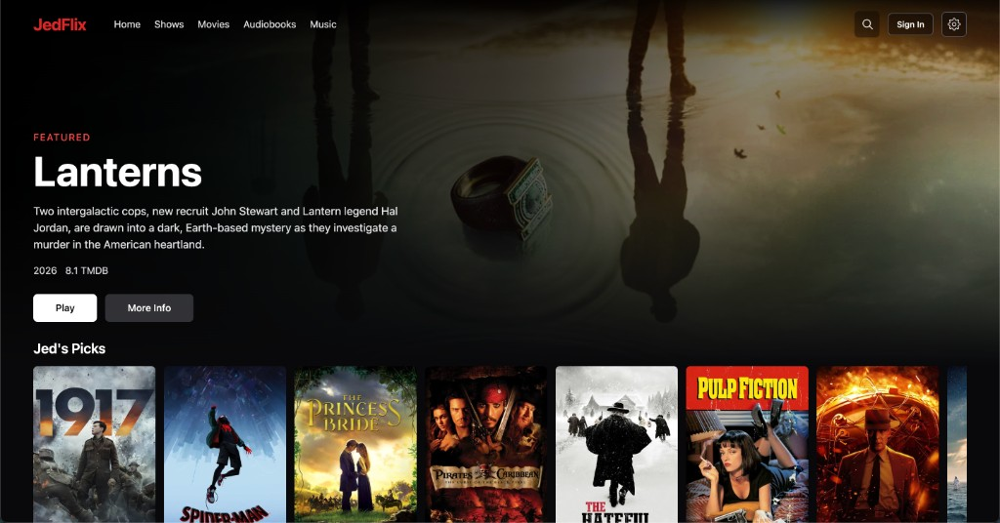
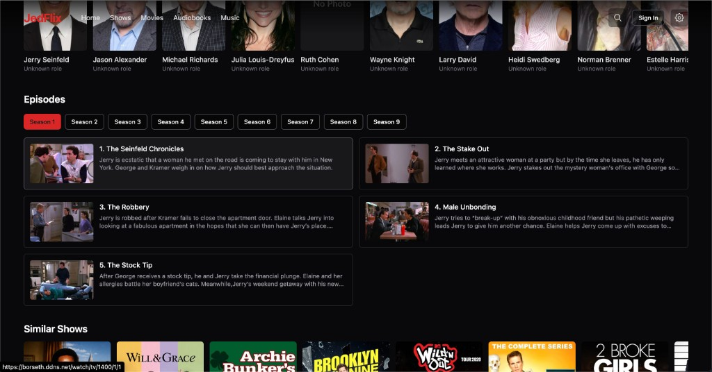
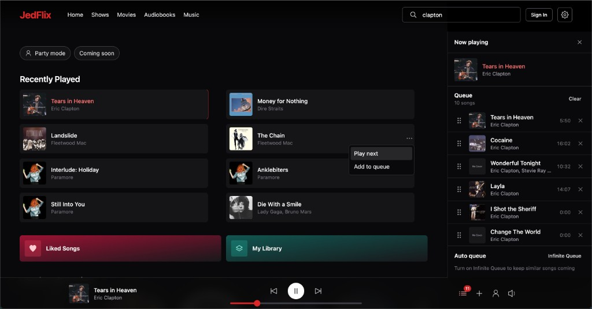

# JedFlix

JedFlix brings movies, TV shows, audiobooks, ebooks, and music together in a single web experience — fast search, direct streaming, and a polished Netflix-style UI.

<p align="center">
  
</p>

> 🚧 **Actively developed** — not intended as a plug-and-play production release.

> 📱 **Built from an iPhone:** A large portion of JedFlix was developed from an iPhone using Cursor. Expect bugs, rough edges, and the occasional "it works on my machine" moment. Contributions and bug reports are welcome!

> 🎵 **AI-powered music search** — a local MusicBrainz dataset plus vector search and Qwen reranking, so searching a huge catalog stays fast and forgiving.


## ✨ Features

### 🎬 Movies & TV

* Netflix-style home page with hero banners and genre rows
* Movie and TV show detail pages
* TMDB metadata
* TV season and episode browsing
* Continue Watching
* Recently Watched
* Watch progress tracking
* My List
* Star ratings and public reviews

### 📺 Streaming

* Torrentio source discovery
* Real-Debrid availability checking
* Source filtering and ranking
* Size and seeder filtering
* Browser compatibility filtering
* Direct Real-Debrid CDN playback
* Full-screen Stremio-style player
* TV episode playback

JedFlix does not store media on the server. Available sources are discovered and resolved through configured services, with playback delivered directly to the client.

### 🎧 Audiobooks & Ebooks

* AudiobookBay source discovery
* Real-Debrid resolution
* Multi-file audiobook and ebook packs
* Continue Listening
* Listening progress tracking
* My List support

### 🎵 Music

JedFlix includes a dedicated music catalog backed by a local MusicBrainz dataset.

* Full MusicBrainz database replica
* Music search with pgvector
* Qwen reranking
* Cover Art Archive integration
* Lazy cover-art caching
* Artist pages
* Album pages
* Track pages
* Similar artists
* Similar tracks
* Artist images
* Music shelves
* Infinite Queue
* YouTube playback through yt-dlp
* Optional Last.fm integration

### 🔎 Search

JedFlix uses specialized search systems for different types of media.

Movie and TV metadata comes from TMDB, while the music catalog is backed by a local MusicBrainz replica.

Music search combines vector search with Qwen reranking to provide relevant results across a large music catalog.

### 🔐 Authentication & User Data

Authentication and user data are handled through Convex.

Supported authentication providers:

* GitHub
* Google

User data includes:

* My List
* Watch history
* Listening history
* Playback progress
* Ratings
* Reviews
* Settings

### 📱 Mobile

JedFlix is designed around a responsive web experience and includes an Expo-based mobile application.

The web application can also be installed as a PWA for a more native-like experience.

---

## 🛠️ Tech Stack

* **Frontend:** React, TypeScript, Vite, Tailwind CSS, shadcn/ui
* **Backend:** Go
* **Database & Backend Services:** Convex
* **Music Database:** MusicBrainz + PostgreSQL + pgvector
* **Music Reranking:** Qwen
* **Music Playback:** yt-dlp / YouTube
* **Movie & TV Metadata:** TMDB
* **Streaming:** Torrentio + Real-Debrid
* **Audiobooks:** AudiobookBay + Real-Debrid
* **Monorepo:** Turborepo
* **Package Manager:** Bun
* **Infrastructure:** Docker, Docker Compose, Caddy

---

## 📸 Screenshots

<p align="center">
  
</p>
<p align="center"><em>Home — hero banner, Jed's Picks, and browse rows</em></p>

<p align="center">
  
</p>
<p align="center"><em>Shows — cast, seasons, episode synopses, and similar titles</em></p>

<p align="center">
  
</p>
<p align="center"><em>Music — recently played, queue, and player</em></p>

---

## ⚙️ Configuration

JedFlix uses environment variables for server-side configuration and allows users to configure their own service credentials through the application.

Example server configuration:

```env
TMDB_API_KEY=
LASTFM_API_KEY=

SPOTIFY_CLIENT_ID=
SPOTIFY_CLIENT_SECRET=

ABB_USERNAME=
ABB_PASSWORD=

REAL_DEBRID_DEMO_CLIENT_KEY=
REAL_DEBRID_DEMO_API_KEY=

RD_BLOCKED_FILENAME_REGEX=
```

You should never commit credentials or API keys to the repository.

---

## 🎵 Music

The music catalog is designed to operate independently from Spotify's catalog API.

JedFlix maintains a local MusicBrainz database containing music metadata and uses vector embeddings and Qwen reranking to improve search quality.

Artwork is retrieved through the Cover Art Archive and cached lazily as it is requested.

Music playback is resolved through YouTube using `yt-dlp`.

---

## 📺 Media Sources

JedFlix uses external services to discover and resolve media sources.

### Movies & TV

**Torrentio → Real-Debrid → Client**

Torrentio is used for source discovery while Real-Debrid is used to resolve available releases into playable CDN URLs.

### Audiobooks & Ebooks

**AudiobookBay → Real-Debrid → Client**

### Music

**Music catalog → YouTube → Client**

The server resolves the requested audio using `yt-dlp`, allowing the client to stream the resulting source.


## 👨‍💻 Author

Built by **[Jed Borseth](https://github.com/JedBorseth)**.
